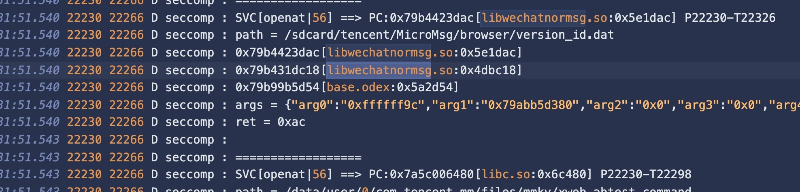
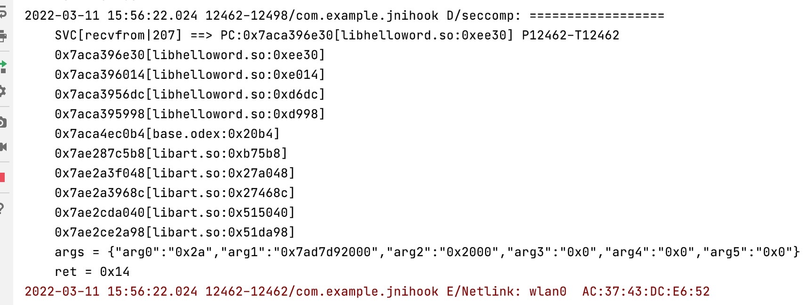
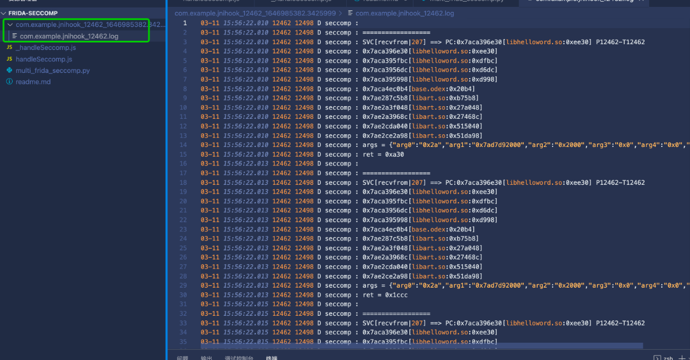

# 一个Android通用svc跟踪以及hook方案——Frida-Seccomp

## 效果
### openat

### recvfrom

# 原理及其介绍
https://bbs.pediy.com/thread-271815.htm
# 如何使用
```
pip3 install frida
python3 multi_frida_seccomp.py
```
log信息可以在logcat过滤“seccomp”查看
同时也自动保存到了「包名\_pid\_时间戳」文件夹内（支持多进程）
